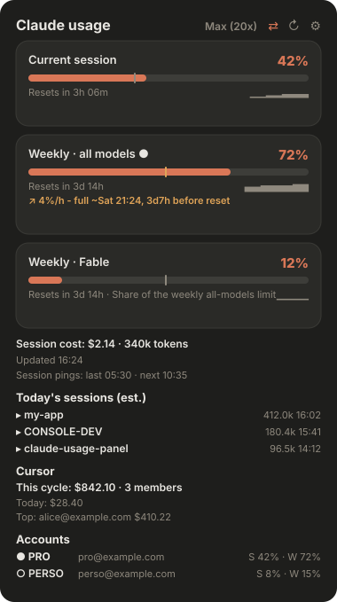

<div align="center">

# Claude Usage Panel

**See your Claude Code plan usage at a glance - in the GNOME top bar, the macOS
menu bar, under your Claude Code prompt, or by just asking Claude.**

Session, weekly, and **per-model** limits (Fable, Opus…) - the same numbers as
`/usage`, always visible, auto-refreshing. Plus an optional **Cursor**
team-spend section.




</div>

---

## Install

One line - it detects your platform and installs the sensible set:

```bash
curl -fsSL https://fschmutz.github.io/claude-usage-panel/install | bash
```

One-click **Add to Cursor** / **Install in Claude Code** buttons live on the
**[install page →](https://fschmutz.github.io/claude-usage-panel/#install)**

Name targets to be explicit (`bash -s -- <target…>` through the one-liner, or
`./install.sh <target…>` from a clone):

| Target | What you get | Details |
|---|---|---|
| `gnome` | Top-bar panel + dropdown, alerts, sparklines (GNOME Shell 45–50) | [docs/GNOME.md](docs/GNOME.md) |
| `macos` | Native SwiftUI menu-bar app, starts at login (macOS 13+) | [macos/README.md](macos/README.md) |
| `statusline` | One-line usage gauge under the Claude Code prompt | [claude-code/README.md](claude-code/README.md) |
| `mcp` | `get_usage` tool inside Claude Code **and** Cursor - ask "how much of my plan have I used?" | [mcp/README.md](mcp/README.md) |
| `autoupdate` | Daily check for a new release, installed automatically (on by default) | [wiki](https://github.com/fschmutz/claude-usage-panel/wiki/Installation#staying-up-to-date) |
| `plan` | Recommend `sessionping` times for your working day (`./install.sh plan --compare 09:00`) | read-only helper |
| `sessionping` | Scheduled `claude` pings that open the 5h session window at your chosen times (opt-in, one haiku turn per ping) | [wiki](https://github.com/fschmutz/claude-usage-panel/wiki/Installation#session-pings) |

**Where did the tokens go?** `node scripts/token-attribution.mjs --days 7`
breaks your spend into exploration / implementation / verification / rework /
correction, so you can see whether the budget went into progress or into
re-doing things.

**Any other Linux bar** - waybar, tmux, polybar, i3blocks - is one command, no
install target needed: `node linux/usage-bar.mjs --format waybar` (see
[linux/README.md](linux/README.md)). **Not sure when to schedule your session
pings?** `./install.sh plan --compare 09:00` scores your current schedule and
prints the better one.

The status line renders like this, right under the prompt input:

```text
Context ▌░░░░░ 8%  Session █▌░░░░ 26% 59m  Week █▌░░░░ 24% 4d2h  ∑ 1.2M tok
```

Everything is reversible and idempotent: `update --pull` upgrades what you
have, `--uninstall [target…]` reverses it, `--dry-run` previews, `--list`
shows what's detected and installed.

**It keeps itself current.** On a git checkout the `autoupdate` target is part
of the default set: once a day it looks for a newer released tag and, if there
is one, fast-forwards and reinstalls exactly the clients you have. It never
touches a checkout with local changes or a diverged branch - it logs the reason
and waits. `scripts/auto-update.sh --status` shows where you stand;
`./install.sh --uninstall autoupdate` turns it off.

The MCP tool also installs without any clone - as a Claude Code plugin
(`/plugin marketplace add fschmutz/claude-usage-panel`, then
`/plugin install claude-usage@claude-usage-panel`) or one CLI line
(`claude mcp add claude-usage -- npx -y github:fschmutz/claude-usage-panel`).

## Why this one

**The numbers are read, not reconstructed.** Every other Claude usage tool in
circulation rebuilds your cost by parsing local JSONL logs and multiplying by a
price table it has to keep current. This one reads your account's own usage
endpoint, so the limit percentages are the same figures `/usage` prints. Those
are different classes of number - an official one can be stale or unreachable,
an estimated one can be quietly wrong - so every value in the UI carries a
provenance marker (`official` / `est.`) and the panel never blurs the two.

Most Claude usage indicators also read the endpoint's legacy `five_hour` /
`seven_day` fields and show only the aggregate session + weekly pair. This one
reads the modern **`limits[]` array**, so it shows **every** limit the Claude
app shows - including **per-model weekly limits** (Fable, Opus…) that the
others miss - on both Linux and macOS, with native UI on each (no Electron),
plus terminal and in-conversation projections.

| | |
|---|---|
| 📊 **All plan limits** | Session, weekly, per-model - one card each, severity colors + reset timers from the API |
| 📈 **Burn-rate forecast** | "↗ 4%/h - full ~Sat 21:24, 3d7h before reset": each limit is projected from your recent pace, the top bar turns amber the moment a limit is *on track* to run dry before its reset, and a notification fires once - trouble visible at 50%, not at 90% |
| 🧮 **Pool-aware** | A per-model card (Fable) is labelled as a *share of* the weekly all-models limit, not extra quota - because that is what it is |
| 🔔 **Alerts + sparklines** | Desktop notification at 90% / 100% and on projected exhaustion, tiny trend graph per limit |
| 💲 **Optional extras** | Local [`ccusage`](https://github.com/ryoppippi/ccusage) session cost · Cursor team spend via Admin API |
| 🔒 **Read-only & private** | Uses your existing local token, never writes it, no telemetry, talks only to official APIs |

## Screenshots

| Dropdown | Settings |
|---|---|
|  |  |

## How it works

Every client reads the OAuth token Claude Code already stores locally
(`~/.claude/.credentials.json` on Linux, the login Keychain on macOS) and calls
the official usage endpoint:

```text
GET https://api.anthropic.com/api/oauth/usage
    authorization: Bearer <token>
    anthropic-beta: oauth-2025-04-20
```

The response's `limits[]` array drives one card per limit. If the token
expires, the panel tells you to run any Claude Code command (which refreshes
it) - it never writes the token itself. The status line is even cheaper: it
renders purely from what Claude Code pipes on stdin, no credentials or network
at all. The optional extras stay just as private: cost runs `ccusage` locally
against `~/.claude/projects/*.jsonl`, and Cursor spend calls `api.cursor.com`
with your own admin key.

## Documentation

| Doc | Covers |
|---|---|
| [docs/GNOME.md](docs/GNOME.md) | GNOME install, Wayland relog, settings, nested-shell testing |
| [macos/README.md](macos/README.md) | macOS build, release, notarization, Homebrew cask |
| [claude-code/README.md](claude-code/README.md) | Status line segments, token modes, manual setup |
| [mcp/README.md](mcp/README.md) | MCP server, `get_usage` tool, all four install paths |
| [CONTRIBUTING.md](CONTRIBUTING.md) | Dev setup, pre-commit hooks, parity-test contract |
| [PUBLISHING.md](PUBLISHING.md) | Store listings, release flow |
| [CHANGELOG.md](CHANGELOG.md) | Version history |

## Roadmap

- [ ] extensions.gnome.org listing *(needs a GNOME store account - [PUBLISHING.md](PUBLISHING.md))*
- [ ] Notarized macOS `.app` + Homebrew cask *(needs an Apple Developer signing cert)*

## License

MIT - see [LICENSE](LICENSE).

---

<div align="center">

<em>Keywords: Claude Code usage monitor · Claude usage GNOME Shell extension · Claude plan limits top bar · macOS menu bar Claude usage · Claude Code status line usage · Claude usage MCP server · Add to Cursor MCP · Anthropic usage API · ccusage · Fable / Opus per-model weekly limit · Cursor Admin API spend · Ubuntu GNOME extension · SwiftUI MenuBarExtra</em>

</div>
